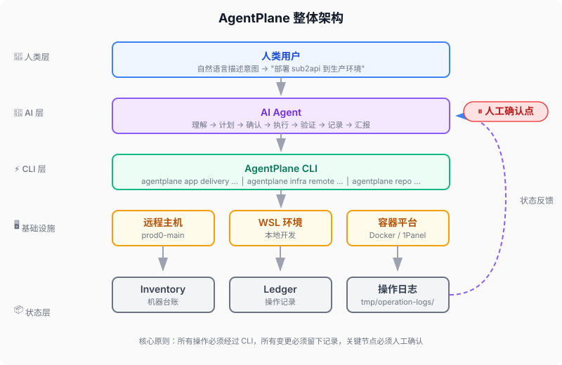

# 🛫 AgentPlane

[](LICENSE)

> **你的基础设施"自动驾驶仪"**——你告诉它目标，它自动检查、执行、验证、留痕。
>
> AgentPlane 是一个 Agent-first control plane template repository。
>
> `.agents/skills` 是 AI Agent 看到的能力入口；`agentplane ...` 是所有正式执行入口。
>
> 当前成熟度：Alpha。仓库治理、离线测试、文档治理和 secrets 边界已经可用；发布自动化、provider 合同和 app delivery schema 仍在收敛。

---

## ❌ 没有 AgentPlane 时

AI 直接执行 `ssh prod "docker restart myapp"`：

- SSH 连不上？失败后才知
- 容器起不来？错误淹没在输出中
- 服务真的好了吗？没有验证
- 谁执行的？什么时候？查不到

## ✅ 有了 AgentPlane

```bash
$ agentplane service apply --target prod --name myapp --execute
[检查] 主机在线 ✓
[执行] 重启容器 myapp ✓
[验证] HTTP 探针 200 OK ✓
[记录] 操作已保存，可随时回查
```

同样的操作，不同的体验：**有计划、有验证、有记录、可回滚**。

---

## 🚀 5 分钟上手

### 1️⃣ 安装

```bash
git clone <你的仓库地址> && cd AgentPlane
uv tool install -e .
```

> 💡 **`uv tool install` 会把 `agentplane` 注册为全局命令。** 如果 `agentplane` 仍不可用，可以改用 `uv run agentplane ...` 或 `python -m agentplane ...`，两者无需全局注册即可运行。

### 2️⃣ 体检

```bash
agentplane bootstrap inspect-local --repo-root .
agentplane bootstrap doctor --repo-root .
agentplane bootstrap init-secrets --repo-root .
agentplane bootstrap verify-secrets --repo-root .
```

### 3️⃣ 查看状态

```bash
agentplane repo status --repo-root . --html tmp/agentplane-status.html
agentplane repo health-check --repo-root .
```

> 💡 体检通过后，Agent 就可以接管后续操作了。

📖 **第一次用？** → [5 分钟了解 AgentPlane](docs/getting-started/5-minute-overview.md)  
🚀 **想动手？** → [部署你的第一个应用](docs/tutorials/deploy-first-app.md)  
🔍 **出错了？** → [排查部署失败](docs/tutorials/troubleshoot-failed-deployment.md)

---

## 📦 能做什么

| 场景 | 说明 |
|------|------|
| 🚀 **一键部署** | 构建 → 上传 → 部署 → 验证 → 回滚，全程标准化 |
| 🖥️ **主机管理** | 盘点服务器资产、执行审计、远程操作 |
| 🐳 **服务管控** | 管理 Docker 服务生命周期，自动健康检查 |
| 🌐 **网站发布** | 自动化公网入口配置（Cloudflare + 1Panel） |
| ✅ **状态验证** | 持续检测配置漂移，发现问题及时报告 |
| 📝 **操作留痕** | 每次操作留下可追溯的审计证据 |

**核心设计**：Skill 路由 • AI 友好 CLI • 配置即代码 • 敏感信息分离 • 跨平台



---

## 🎯 项目边界

AgentPlane 不是 Terraform、Kubernetes controller 或 SSH 脚本集合。它更像一个给 AI Agent 使用的轻量控制面：把正式操作收口到 `agentplane ...`，再把计划、执行、验证、证据、台账和文档回写串成闭环。

| 适合 | 不适合 |
|------|--------|
| 少量服务器和应用的 AI-assisted 运维 | 大型多租户平台控制器 |
| 需要公开仓库与生产 secrets 分离 | 把生产 secrets 放进 Git 管理 |
| 需要稳定任务入口和审计证据 | 只想保留一次性 SSH/Docker 命令 |
| 应用仓库只交付代码和合同 | 应用仓库自带第二套生产控制面 |

详细边界见 [项目定位](docs/reference/project-positioning.md)，演进计划见 [Roadmap](ROADMAP.md)。

---

## 🗣️ 怎么告诉 AgentPlane 你要做什么

不用记命令，用自然语言描述：

> "把 sub2api 部署到 prod0-main，用最新镜像，先预览变更，确认后再执行，部署完验证健康状态。"

AI 会自动转换为**计划 → 执行 → 验证 → 记录**的完整闭环。  
更多示例见 [AI 执行流程](docs/getting-started/how-agent-works.md#怎么描述意图)。

---

## 📖 文档导航

**👤 人类入口**：
[5 分钟速览](docs/getting-started/5-minute-overview.md) ·
[核心概念](docs/getting-started/core-concepts.md) ·
[部署应用](docs/runbooks/app-project-delivery-workflow.md) ·
[AI 执行流程](docs/getting-started/how-agent-works.md)

**🤖 AI 入口**：
[AGENTS.md](AGENTS.md) ·
[Skill 盘点](docs/maintainers/skill-surface-audit.md) ·
[control-plane.md](docs/architecture/control-plane.md) ·
[execution-flow.md](docs/runbooks/control-plane-agent-execution-flow.md)

---

## 🤝 参与项目

| 文档 | 说明 |
|------|------|
| [LICENSE](LICENSE) | MIT 开源许可证 |
| [CONTRIBUTING.md](CONTRIBUTING.md) | 如何参与开发 |
| [Git 规范](docs/reference/git-conventions.md) | 分支、提交、PR 与 main 合并规则 |
| [SECURITY.md](SECURITY.md) | 安全策略 |
| [CODE_OF_CONDUCT.md](CODE_OF_CONDUCT.md) | 行为准则 |
| [SUPPORT.md](SUPPORT.md) | 获取帮助 |
| [ROADMAP.md](ROADMAP.md) | 项目成熟度与路线图 |
| [CHANGELOG.md](CHANGELOG.md) | 版本变更摘要 |

---

## 长期愿景

AgentPlane 的长期目标，是从 AI-assisted 运维控制面，演进为新项目从创建、开发、发布、部署到运维的统一控制面。
更多规划见 [Roadmap](ROADMAP.md) 和 [项目定位](docs/reference/project-positioning.md)。
