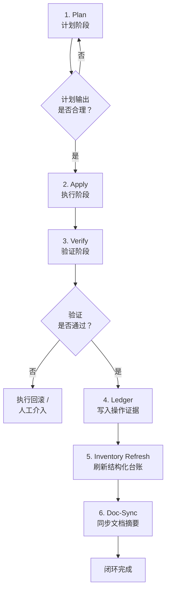
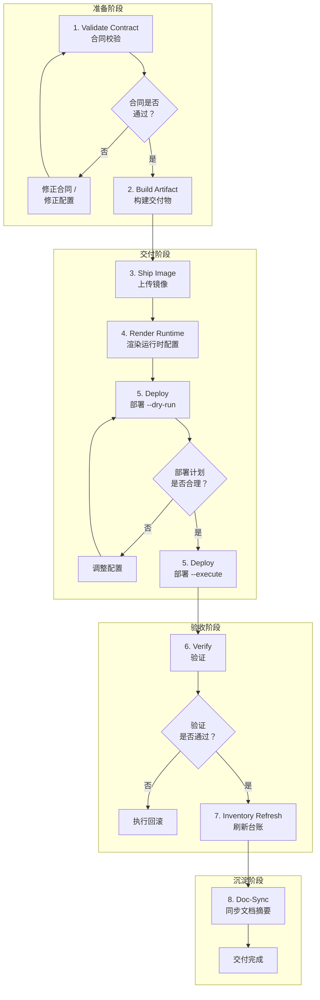

# AgentPlane 核心概念与工作流程

> 本文档面向第一次接触 AgentPlane 的开发者，帮助你建立对项目整体架构和工作流程的直观理解。阅读完本文后，你可以继续深入具体的 [runbook](../runbooks/) 和 [architecture](../architecture/) 文档。

---

## 总览：AgentPlane 是什么？

AgentPlane 是一个**面向 AI Agent 的基础设施控制平面**。它的核心使命是：

> **让 AI 能够安全、规范、可审计地管理你的服务器和应用部署。**

在传统的工作流中，AI 直接执行 Shell 命令来操作服务器——这相当于让一个没有安全护栏的机器人直接操作生产线，风险极高。AgentPlane 通过引入**标准化入口、状态验证和审计链**，把 AI 的操作约束在受控的框架内。

---

## 四大核心概念

### 1. 真源与三层状态模型

在分布式系统管理中，"真源"是指被所有组件共同承认的**权威状态定义**。AgentPlane 的真源只有一类：

- **配置真源**（Desired State）：定义"我们期望系统应该是什么样"
  - 普通配置：`docs/`、`infra/compose/`、`templates/`、`inventory/` —— Git 版本控制
  - 敏感配置：`secrets/` —— 本地文件系统，不提交 Git

> 💡 **为什么敏感配置也是真源？** 因为它同样是期望状态的权威定义，只是出于安全考虑不放入 Git 历史。

AgentPlane 的核心工作是**持续对比以下三层状态**，发现配置漂移时及时报告：

| 状态层级 | 来源 | 回答的问题 | 示例 |
|---------|------|-----------|------|
| **期望状态（Desired）** | 真源：Git 中的配置 | "我们期望系统应该是什么样？" | Compose 文件定义了 3 个容器 |
| **实际状态（Actual）** | 现场实时查询 | "系统实际是什么样？" | `docker ps` 只显示 2 个容器在运行 |
| **观测状态（Observed）** | Inventory / Ledger | "上次验证时记录的状态是什么？" | `inventory.json` 中记录了 2 个容器 |

**对比示例**：Git 中的 Compose 文件定义了 3 个容器，但现场只运行了 2 个——这就是期望状态与实际状态的不一致，需要处理。

> 💡 **为什么不用现场状态作为真源？** 因为现场状态是易变的、不可追溯的。今天容器在运行，明天可能被手动停掉了。Git 管理的配置可以回滚到任意历史版本，而现场状态不能。

---

### 2. Task-Entry（标准化任务入口）

Task-Entry 是 AgentPlane 中最重要的设计模式之一。它回答的问题是：**"AI 应该怎么操作基础设施？"**

**传统方式的问题**：

```bash
# ❌ 危险：AI 直接执行原始命令
ssh user@prod-server "docker restart myapp"
```

问题在哪？
- **没有前置检查**：SSH 连不上？容器不存在？你只能在失败之后才知道
- **没有错误处理**：命令输出什么错误？怎么恢复？全靠人工解读
- **没有审计记录**：谁执行了这个操作？什么时候？查不到
- **没有状态验证**：容器重启了，但服务真的正常了吗？不知道

**AgentPlane 的方式**——同样的场景，不同的体验：

```bash
# ✅ 安全：通过标准化入口操作
$ agentplane service verify --target prod0-main --name myapp

[检查] 目标主机 prod0-main 在线 ✓
[检查] 容器 myapp 存在，状态: running ✓
[验证] HTTP 健康检查: 200 OK ✓
[审计] 操作已写入 tmp/operation-ledger/20260423-095830-verify-myapp.jsonl
```

每个 Task-Entry 都封装了：

1. **前置检查** — 自动验证主机在线、容器存在等依赖条件
2. **后端路由** — 自动选择 WSL / SSH / Docker 执行后端
3. **错误处理** — 结构化错误 + 恢复建议（例如："容器不存在，建议先执行 agentplane service apply..."）
4. **审计记录** — 自动写入 operation ledger，完整保留操作上下文

**对象分层**：

AgentPlane 把基础设施抽象为 4 个对象域 + 横切机制，每个域有独立的 Task-Entry：

| 对象域 | 管理内容 | 典型命令 |
|--------|---------|---------|
| `infra` | 主机资产、SSH 连接、网络治理 | `infra inventory`、`infra audit`、`infra remote bash` |
| `service` | 运行中的服务（容器、数据库等） | `service search`、`service verify`、`service apply` |
| `ingress` | 公网入口、域名、证书 | `ingress publish plan`、`ingress verify` |
| `app` | 应用交付（构建、部署、回滚） | `app delivery validate-contract`、`app delivery deploy` |
| `projection` | 派生数据、验证、台账 | `projection verification run`、`projection ledger refresh` |

---

### 3. Resolver / Backend（跨平台解析层）

AgentPlane 支持 Windows、Linux、macOS 三种宿主环境。Resolver / Backend 层负责**把统一的逻辑路径解析为当前平台可执行的具体操作**。

> 💡 **逻辑路径 vs 物理路径**：Git 仓库中的文件位置是逻辑路径（如 `infra/compose/sub2api/docker-compose.prod0.yml`），它不包含任何平台信息，在所有环境中都一样。而物理路径是操作系统实际访问该文件时的绝对路径（如 `D:\Projects\...` 或 `/mnt/d/...`），每个平台都不同。AgentPlane 的所有真源和台账只保存逻辑路径，物理路径只在运行时由 Resolver 动态生成。

**举个例子**：你在 Windows 上编辑 `infra/compose/sub2api/docker-compose.prod0.yml`，然后通过 AgentPlane 部署到 Linux 生产服务器。同一个逻辑路径在不同平台解析为不同的物理路径：

| | 路径 |
|---|---|
| **逻辑路径**（真源中保存的） | `infra/compose/sub2api/docker-compose.prod0.yml` |
| **Windows 物理** | `D:\Projects\AgentPlane\infra\compose\sub2api\docker-compose.prod0.yml` |
| **WSL 物理** | `/mnt/d/Projects/AgentPlane/infra/compose/sub2api/docker-compose.prod0.yml` |
| **Linux 物理** | `/opt/agentplane/infra/compose/sub2api/docker-compose.prod0.yml` |

**设计原则**：平台差异只留在 Resolver / Backend 层，上层的 Task-Entry、对象模型、Runbook 完全平台无关。这意味着：

- 同一套文档在所有平台上都适用
- 同一套命令在所有平台上都执行
- AI 不需要关心"这是在 Windows 还是 Linux 上"

---

### 4. 投影链（Projection Chain）

投影链描述的是**现场操作结果如何沉淀为可追溯的结构化记录**。

```
现场操作（Live Operation）
    ↓
Operation Ledger（机器证据，JSON Lines 格式）
    ↓
Inventory（结构化台账，JSON 格式）
    ↓
文档摘要（人类可读，Markdown 格式）
```

| 层级 | 格式 | 回答的问题 | 更新时机 |
|------|------|-----------|---------|
| **Operation Ledger** | `tmp/operation-ledger/*.jsonl` | "这次操作具体做了什么？命令输出是什么？" | 每次操作后自动写入 |
| **Inventory** | `inventory/servers/<target>/inventory.json` | "目标环境有哪些受管对象？当前状态是什么？" | `ledger refresh --write` |
| **文档摘要** | `docs/AGENTPLANE_DEPLOYMENT.*.md` | "当前正式口径是什么？有哪些已知问题？" | `doc-sync --write` |

**为什么需要投影链？**

- **Ledger** 是机器证据，保留完整的操作上下文，用于故障排查
- **Inventory** 是结构化快照，用于快速查询和对账
- **文档摘要** 是人类入口，让不看代码的人也能了解系统状态

---

## 执行闭环（Execution Loop）

AgentPlane 对任何影响正式状态的操作，都强制遵循 **6 步闭环**：



### 各阶段详解

#### 1. Plan（计划）

**作用**：预览将要执行的操作，但不真正改变系统状态。

```bash
agentplane service plan --target wsl --name redis --operation reconcile
agentplane app delivery deploy --target prod0-main --app sub2api --dry-run
```

**关键特性**：
- `--dry-run` 与 `--execute` 互斥，必须显式选择
- 计划输出应包含：变更清单、风险评估、预期结果
- 计划阶段发现的问题应在执行前解决

#### 2. Apply（执行）

**作用**：在计划确认无误后，真正执行变更。

```bash
agentplane service apply --target wsl --name redis --operation reconcile --execute
agentplane app delivery deploy --target prod0-main --app sub2api --execute
```

**安全规则**：
- 高风险操作必须在计划阶段通过后，才能加 `--execute`
- 执行失败时，系统应保留足够信息用于后续回滚或排查

#### 3. Verify（验证）

**作用**：执行后必须验证系统是否达到预期状态。

```bash
agentplane service verify --target wsl --name redis
agentplane app delivery verify --target prod0-main --app sub2api --execute
agentplane projection verification run --target wsl --profile wsl-fixture
```

**验证原则**：
- 优先检查 **live state**（实际运行的容器、服务响应），而非文档
- 如果验证失败，不应继续后续步骤
- 验证结果应包含证据（如 HTTP 响应、容器状态输出）

#### 4. Ledger（记录）

**作用**：把操作过程和结果写入机器可读的证据文件。

- 写入位置：`tmp/operation-ledger/<timestamp>-<operation-id>.jsonl`
- 内容：命令、参数、输出、错误、时间戳
- 用途：故障排查、审计追溯

#### 5. Inventory Refresh（刷新台账）

**作用**：基于最新的 live state 更新结构化台账。

```bash
agentplane projection ledger refresh --target wsl --write
```

- 更新 `inventory/servers/<target>/inventory.json`
- 确保台账与现场状态一致
- `--write` 表示真正写入，不加则只预览差异

#### 6. Doc-Sync（同步文档）

**作用**：把操作结果回写到人类可读的文档中。

```bash
agentplane app delivery doc-sync --target prod0-main --app sub2api --write
```

- 更新应用仓库中的 `docs/AGENTPLANE_DEPLOYMENT.*.md`
- 让非技术人员也能了解当前部署状态

---

## 应用交付全流程（App Delivery Workflow）

应用交付是 AgentPlane 最复杂的场景，它把执行闭环应用到了"应用部署上线"的完整生命周期中。



### 各阶段详解

#### 1. Validate Contract（合同校验）

**作用**：在构建和部署之前，先验证应用仓库提供的 `deploy/agentplane/contract.yaml` 是否合规。

```bash
agentplane app delivery validate-contract --target prod0-main --app sub2api
```

**校验内容**：
- `schema_version` 是否支持
- 必需字段是否完整（`app_id`、`artifact`、`runtime`、`infra`）
- 引用的容器名、路径是否符合命名规范
- 依赖的服务是否在 inventory 中已声明

**为什么必须先校验合同？** 因为合同是后续所有步骤的输入。如果合同有问题，构建出的镜像可能是错的，部署也会失败。在校验阶段暴露问题，成本最低。

#### 2. Build Artifact（构建交付物）

**作用**：在 WSL / Linux 后端执行构建脚本，生成运行时产物。

```bash
agentplane app delivery build-artifact --target wsl --app sub2api --image-tag v1.0.0
```

**推荐模式**：
1. 执行应用仓库的 `deploy/build-runtime-artifacts.sh`
2. 生成 `dist/oplinux/` 目录下的产物
3. 用 `deploy/package-runtime-image.sh` 打包为 Docker 镜像

**注意**：不推荐把编译依赖下载、前端构建、后端编译全部塞进 Dockerfile 的 `RUN` 指令中。先在宿主机构建好产物，再用精简的 runtime Dockerfile 打包，这样镜像更小、构建更快、更易于审计。

#### 3. Ship Image（上传镜像）

**作用**：把构建好的镜像推送到目标环境可访问的镜像仓库。

```bash
agentplane app delivery ship-image --target prod0-main --app sub2api --image-ref sub2api:v1.0.0
```

#### 4. Render Runtime（渲染运行时配置）

**作用**：根据合同和环境信息，生成最终的运行时配置文件（如完整的 Docker Compose 文件、env 文件）。

```bash
agentplane app delivery render-runtime --target prod0-main --app sub2api --image-ref sub2api:v1.0.0
```

**关注 4 件事**：
- 容器名是否按规范命名（`<app>-prod`）
- 宿主机绑定端口是否正确
- 依赖容器是否已声明
- 持久化挂载路径是否收口到 `/data/<app>/...`

#### 5. Deploy（部署）

**作用**：把应用真正部署到目标环境。

```bash
# 先预览
agentplane app delivery deploy --target prod0-main --app sub2api --image-ref sub2api:v1.0.0 --dry-run

# 再执行
agentplane app delivery deploy --target prod0-main --app sub2api --image-ref sub2api:v1.0.0 --execute
```

**部署原则**：
- `--dry-run` 必须在前，`--execute` 在后
- 生产目标在 `deploy --execute` 前后，会自动触发网络对齐检查
- 部署前先创建回滚态（已知良好的上一个状态）

#### 6. Verify（验证）

**作用**：部署完成后，验证应用是否正常运行。

```bash
agentplane app delivery verify --target prod0-main --app sub2api --execute
```

**验证内容**：
- 容器是否正常运行（`docker ps`）
- 健康检查端点是否返回预期状态码
- 依赖服务是否可达
- 公网入口是否可访问

#### 7-8. Inventory Refresh & Doc-Sync（回写）

与执行闭环中的对应步骤一致，把交付结果沉淀到台账和文档中。

---

## 对象模型速查

| 对象域 | 回答的问题 | 典型对象 | 关键动词 |
|--------|-----------|---------|---------|
| **infra** | 这台服务器上有什么？ | `inventory`、SSH 配置、网络 | `inventory`、`audit`、`remote bash`、`live-gate` |
| **service** | 这个服务状态如何？ | `postgres`、`redis`、`minio`、自定义服务 | `search`、`get`、`verify`、`plan`、`apply` |
| **ingress** | 这个网站入口配好了吗？ | 1Panel 入口对象、域名、证书 | `publish plan`、`publish apply`、`verify` |
| **app** | 这个应用交付了吗？ | `catalog`、应用资源、交付合同 | `validate-contract`、`build-artifact`、`deploy`、`verify` |
| **projection** | 现场状态和预期一致吗？ | `runtime-env`、验证套件、台账 | `verification run`、`ledger refresh` |

---

## 关键术语速查

| 术语 | 含义 | 类比理解 |
|------|------|---------|
| **Source of Truth（真源）** | 被所有系统承认的权威状态定义 | Git 中的配置文件 = 真源；现场状态 = 验证基准 |
| **Task-Entry** | 面向 AI 的标准化操作入口 | 不是直接操作底层资源，而是通过高层语义化命令 |
| **Resolver** | 把逻辑路径解析为当前平台的物理路径 | Windows 路径 → WSL 路径 → Linux 路径的自动转换 |
| **逻辑路径** | 与平台无关的仓库内相对路径 | `infra/compose/sub2api/docker-compose.prod0.yml` |
| **物理路径** | 操作系统实际访问文件的绝对路径 | `D:\Projects\AgentPlane\...` 或 `/opt/agentplane/...` |
| **Live State** | 通过现场命令/API 获取的真实状态 | `docker ps`、HTTP 健康检查的结果 |
| **Ledger** | 机器生成的操作证据 | 每次 CLI 操作的完整记录，用于审计 |
| **Inventory** | 结构化状态台账 | 目标环境所有受管对象的摘要快照 |
| **Projection** | 从现场状态到结构化记录的转换过程 | Live State → Ledger → Inventory → 文档 |
| **Contract** | 应用仓库与 AgentPlane 之间的交付合同 | `deploy/agentplane/contract.yaml` |
| **Catalog** | 应用对象注册表 | `inventory/apps/catalog.json` 中的受管应用列表 |

---

## 下一步

理解了核心概念后，你可以按需深入：

- **想要上手操作？** → [README.md](../../README.md#快速开始)
- **想了解应用交付的详细步骤？** → [app-project-delivery-workflow.md](../runbooks/app-project-delivery-workflow.md)
- **想了解 Agent 的执行规范？** → [control-plane-agent-execution-flow.md](../runbooks/control-plane-agent-execution-flow.md)
- **想了解控制面架构设计？** → [control-plane.md](../architecture/control-plane.md)
- **想了解 AgentPlane 与应用仓库的协作规范？** → [agentplane-app-collaboration.md](../architecture/agentplane-app-collaboration.md)
- **想知道当前项目状态？** → [current-state-and-validation.md](../runbooks/current-state-and-validation.md)
