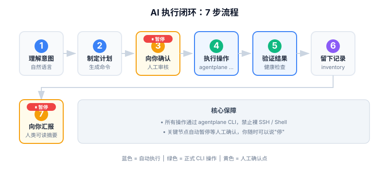

# 🤖 AI 是怎么工作的？

结论：AgentPlane 中的 AI 不是"黑箱操作"。它每次执行都遵循固定套路——先计划、再确认、后执行、必验证、留记录。人类在关键节点介入，其余由 AI 自动完成。

---

## 每次对话开始时，AI 会收到什么？

每次你与 AgentPlane 的 AI 对话时，系统会自动给它发送一份工作手册（[AGENTS.md](../../AGENTS.md)），里面包含：

- **必须遵守的规则**：比如所有操作必须从 `agentplane ...` 进入，敏感信息绝不提交 Git
- **正式入口清单**：不同场景该用什么命令
- **禁止事项**：比如不能直接执行原始 SSH 命令

> 💡 这相当于给 AI 戴上了"安全护栏"，确保它不会越界操作。

---

## 人类说一句话，AI 会做什么？

当你对 AI 说：

> "把 sub2api 部署到 prod0-main，用最新镜像，先预览变更，确认后再执行。"

AI 会执行以下流程：



```
1. 理解意图 → 2. 制定计划 → 3. 向你确认
4. 执行操作 → 5. 验证结果 → 6. 留下记录 → 7. 向你汇报
```

### 第 1 步：理解意图

AI 会把你的自然语言翻译成结构化意图：

| 要素 | 你的输入 | AI 的理解 |
|------|---------|----------|
| 目标 | 部署 sub2api | 应用交付操作 |
| 环境 | prod0-main | 目标主机 |
| 版本 | 最新镜像 | 使用最新构建的镜像 |
| 约束 | 先预览再执行 | 必须走 Plan → Apply 两步 |

### 第 2 步：制定计划

AI 生成具体的执行计划：

```bash
agentplane app delivery validate-contract --target prod0-main --app sub2api
agentplane app delivery build-artifact --target prod0-main --app sub2api --image-tag latest
agentplane app delivery deploy --target prod0-main --app sub2api --dry-run
```

### 第 3 步：向你确认

AI 会停下来问你：

> "计划如下：先校验交付配置，再构建镜像，最后预览部署。预计变更：更新容器 sub2api-prod，重启 1 个服务。是否继续？"

**这是人类的第一个介入点**。如果你不同意，AI 会重新调整计划。

### 第 4 步：执行操作

你确认后，AI 才会加上 `--execute` 真正执行：

```bash
agentplane app delivery deploy --target prod0-main --app sub2api --execute
```

### 第 5 步：验证结果

执行后，AI 必须验证：

```bash
agentplane app delivery verify --target prod0-main --app sub2api --execute
```

验证内容包括：容器是否运行、健康检查是否通过、公网入口是否可访问。

### 第 6 步：留下记录

AI 会自动：
- 把操作记录写入机器证据目录（`tmp/operation-logs/`）
- 刷新状态记录目录（`inventory/`）
- 更新相关文档摘要

### 第 7 步：向你汇报

AI 会给你一份人类可读的摘要：

> "已完成 sub2api 到 prod0-main 的部署。验证结果：容器运行正常，HTTP 探针 200 OK，公网入口 https://token.example.net:8443 可访问。操作记录已保存。"

---

## 人类什么时候必须介入？

以下场景 AI 会**自动暂停**并转人工确认：

| 场景 | 为什么需要人工 |
|------|--------------|
| 高风险正式切换 | 可能影响生产服务可用性 |
| 证书、域名、入口变更 | 涉及公网可达性，错误代价高 |
| 数据迁移或回滚 | 可能导致数据丢失 |
| 计划输出与预期明显不一致 | AI 可能对现场状态理解有误 |
| 验证结果与预期冲突 | 需要人工判断是预期错了还是现场错了 |

> ⚠️ **你的权力**：任何时候你都可以说"停"，AI 会立即停止执行。

---

## 人类怎么判断 AI 做得对不对？

### 看命令，不看结果描述

AI 应该明确告诉你它执行了哪些 `agentplane ...` 命令。**如果 AI 执行的是原始 Shell 命令而不是 `agentplane ...`，那就是越界了**。

### 看验证，不看"已完成"

AI 说完"已完成"后，必须附带验证证据：
- 容器状态输出
- HTTP 健康检查响应
- 或者明确的"验证通过/失败"结论

### 看记录，不看记忆

AI 不会说"我记得上次部署成功了"。它应该指向具体的记录文件或记录位置。

---

## 人类与 AI 的分工

| 责任 | 人类 | AI |
|------|------|-----|
| 定目标 | ✅ 描述你要做什么 | ❌ |
| 定约束 | ✅ 说清边界和风险接受度 | ❌ |
| 制定计划 | ❌ | ✅ 生成可执行计划 |
| 确认计划 | ✅ 审核并批准 | ❌ |
| 执行操作 | ❌ | ✅ 通过 `agentplane ...` 执行 |
| 验证结果 | ❌ | ✅ 运行验证命令 |
| 验收 | ✅ 看摘要和证据 | ❌ |
| 异常处理 | ✅ 关键决策 | ✅ 初步排查和回滚建议 |

---

## 🔗 关联文档

- [AGENTS.md](../../AGENTS.md) — AI 的完整工作规范
- [control-plane-agent-execution-flow.md](../runbooks/control-plane-agent-execution-flow.md) — AI 执行闭环的技术规范
- [core-concepts.md](core-concepts.md) — AgentPlane 核心概念
